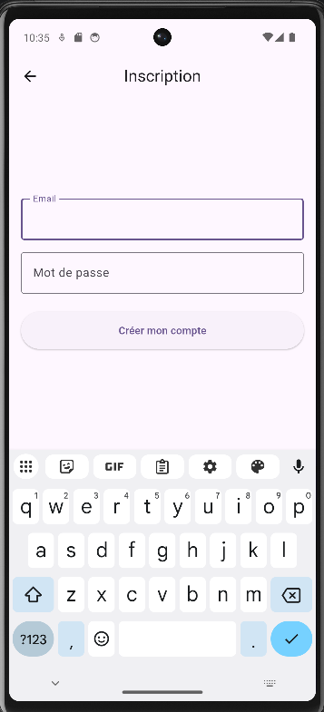
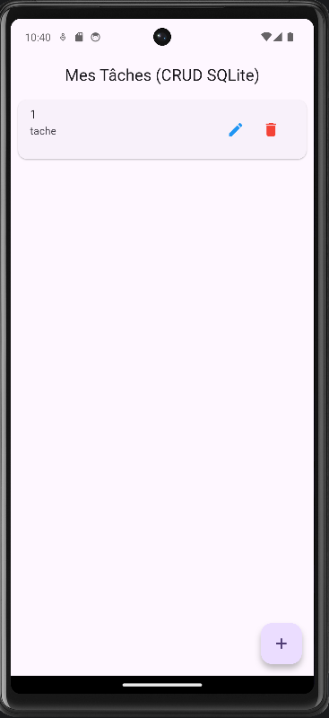
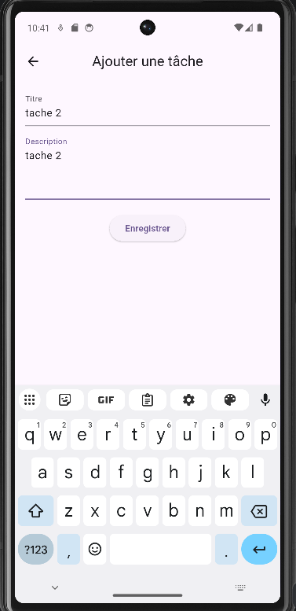

# 📱 Application de Gestion de Tâches Mobile - Mini-Projet Flutter


## 🏫 Présentation du Projet

Ce projet a été développé dans le cadre du cycle d'ingénieur en informatique à l'**ENSA**. Il vise à mettre en pratique les concepts avancés du développement mobile.

* **Auteur :** Haron Jadid
* **Niveau :** 2ème Année Cycle Ingénieur (GINF)
* **Année Universitaire :** 2025/2026
* **Date Limite de Remise :** 07 Juin 2026

L'objectif de cette application est de proposer un gestionnaire de tâches complet respectant rigoureusement le modèle architectural imposé (MVC) et l'intégration de la persistance de données locale.

---

## 🏗️ Architecture Logicielle : Patron MVC

Pour ce projet, le patron de conception architectural **MVC (Modèle-Vue-Contrôleur)** a été strictement appliqué afin d'isoler la logique métier de l'interface utilisateur, garantissant ainsi un code maintenable et évolutif.

    lib/
    ├── models/       # Modèles (M) : Définition des entités et mappage DB
    ├── controllers/  # Contrôleurs (C) : Logique métier, accès SQLite et Auth
    └── views/        # Vues (V) : Interfaces graphiques responsives

### Rôles des composants implémentés :

1. **Les Modèles (`Task`, `User`) :** Ils représentent les entités métiers pures. Ils n'ont aucune dépendance avec l'interface graphique. Ils intègrent des méthodes de sérialisation (`toMap()` et `fromMap()`) pour s'interfacer de manière transparente avec la base de données.
2. **Les Contrôleurs (`TaskController`, `AuthController`) :** Ils agissent comme le cerveau de l'application. Ils initialisent la base de données locale `todo_app.db`, exécutent les requêtes SQL (CRUD, vérification des identifiants) et retournent les statuts d'exécution aux vues.
3. **Les Vues (`auth/`, `tasks/`) :** Ce sont les éléments graphiques construits avec Material 3. Elles capturent les événements de l'utilisateur, effectuent des validations de surface (ex: format de l'email) via les `FormState`, puis invoquent les méthodes des contrôleurs de manière asynchrone.

---

## 🚀 Fonctionnalités Implémentées

### 🎯 Exigences Minimales Obligatoires
* **Authentification Complète :** Système de `Login` et `Register` dynamique stocké localement.
* **Navigation :** Gestion fluide du routage entre les différents écrans de l'application.
* **Système CRUD :** Création, Lecture, Modification et Suppression des tâches.
* **Validation de Formulaires :** Analyse stricte des saisies utilisateur (champs vides, format d'email, longueur du mot de passe).
* **Interface Design :** Application structurée et responsive.

### ✨ Fonctionnalités Avancées (Bonus)
* **Persistance Locale Sécurisée :** Utilisation de `sqflite` pour garantir la sauvegarde des données même après la fermeture de l'application.
* **Dark Mode Natif :** L'interface s'adapte automatiquement au thème (Clair/Sombre) configuré sur le système d'exploitation de l'appareil.

---

## 📱 Captures d'Écran

## 📱 Captures d'Écran

| Connexion & Inscription | Liste des Tâches (CRUD) | Création d'une Tâche |
| :---: | :---: | :---: |
|  |  |  |
---

## 🛠️ Installation et Exécution

### Prérequis
* **Flutter SDK** (Version `>= 3.0.0`)
* **Dart SDK**
* Un émulateur configuré (Android Studio / Xcode) ou un smartphone physique en mode débogage USB.

### Procédure de lancement

1. **Cloner le dépôt :**
   ```bash
   git clone https://github.com/HaronJadid/nom-du-repo.git
   cd nom-du-repo

2. **Récupérer les dépendances :**
   ```bash
   flutter pub get
   ```

3. **Vérifier les périphériques connectés :**
   ```bash
   flutter devices
   ```

4. **Exécuter l'application :**
   ```bash
   flutter run
   ```  